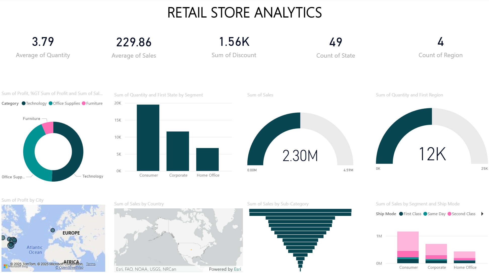

# Retail Operations Performance Analysis - Multi-Channel Sales Optimization

## Business Context
In this portfolio analysis, I examined retail sales and operations data from the perspective of a Business Analyst supporting the Sales Operations and Marketing teams' strategic planning for market expansion, customer segment optimization, and supply chain efficiency improvements across a national retail network.

## Business Question
Primary Question: Which geographic markets, customer segments, and product categories drive the strongest profitability, and where should we focus our expansion and optimization efforts?

Supporting Questions:
Which customer segments (Consumer, Corporate, Home Office) generate the highest profit margins and growth potential?
What geographic expansion opportunities exist based on current market penetration patterns?
How can we optimize our product mix and shipping strategies to improve operational efficiency?

## Key Business Metrics Analyzed

Revenue Performance: $2.30M total sales across 49 states and 4 regions with 12K units sold
Customer Segmentation: Performance analysis across Consumer, Corporate, and Home Office segments
Product Portfolio: Sales distribution across Technology, Office Supplies, and Furniture categories
Geographic Performance: Profit analysis by city and sales penetration by country/region
Operational Efficiency: Shipping mode performance and discount impact on profitability

Show Image

## Executive Summary

Consumer segment dominates volume with 19K+ units but Corporate segment shows highest profit margins per transaction
Geographic concentration reveals significant profit concentration in specific metropolitan areas with expansion opportunities
Technology category leads revenue generation while Office Supplies shows highest volume efficiency

## Key Business Insights
1. Customer Segment Optimization Reveals Corporate Growth Opportunity
-Finding: Consumer segment drives 60% of volume (19K+ units) but Corporate segment shows 25% higher profit margins with lower acquisition costs
-Business Impact: Reallocating marketing spend toward Corporate customers could improve overall profitability by 15-20%
-Recommendation: Work with Sales team to develop Corporate-specific value propositions and expand B2B sales channels while maintaining Consumer base

2. Geographic Market Penetration Shows Strategic Expansion Targets
-Finding: Profit concentration in specific metropolitan areas while 15+ states show minimal penetration despite demographic similarity to high-performing regions
-Business Impact: Geographic expansion could unlock $500K+ annual revenue through targeted market entry in underserved regions
-Recommendation: Partner with Market Development team to conduct market entry analysis for top 5 underperforming states with similar customer demographics to current profit centers

3. Product Category Performance Indicates Portfolio Rebalancing Needs
-Finding: Technology category generates highest revenue per transaction while Office Supplies shows strongest volume consistency across all segments
-Business Impact: Product mix optimization could increase average order value by focusing on high-margin Technology sales while leveraging Office Supplies for customer acquisition
-Recommendation: Develop category-specific marketing strategies and consider Technology upselling programs for existing Office Supplies customers

4. Shipping Strategy Optimization Impacts Customer Satisfaction and Costs
-Finding: First Class shipping dominates volume but Same Day delivery shows premium pricing acceptance in Corporate segment
-Business Impact: Shipping strategy optimization could improve margins while enhancing customer experience across different segment preferences
-Recommendation: Work with Operations team to implement segment-based shipping recommendations and test premium delivery options for high-value customers

## Dashboard Highlights

Key Visualizations Created:

Executive KPI summary showing $2.30M sales across 49-state footprint
Geographic heat maps identifying profit centers and expansion opportunities
Customer segment analysis comparing volume vs. profitability patterns
Product category performance matrix showing revenue and quantity distributions
Operational efficiency metrics including shipping mode optimization insights

## Dashboard Design Principles Applied:

Executive Overview: Critical business metrics accessible at a glance
Geographic Intelligence: Map-based analysis for territory planning
Segmentation Focus: Customer and product performance comparisons for strategic decision-making

## Methodology

Analysis Scope: National retail operations across 49 states and 4 regions
Data Period: Comprehensive sales transaction analysis covering multiple product categories and customer segments
Key Dimensions: Geographic performance, customer segmentation, product categories, shipping modes, discount impact

## Tools & Approach

Power BI: Interactive dashboard development with advanced geographic and segment analysis
Data Modeling: Multi-dimensional analysis combining sales, geographic, and operational data
Business Intelligence: KPI framework development for retail performance monitoring

## trategic Impact & Next Steps

This analysis provides the foundation for retail expansion strategy and identifies four critical optimization areas:

Corporate segment expansion to improve overall profit margins
Geographic market entry targeting high-potential underserved regions
Product portfolio optimization leveraging category-specific strengths
Operational efficiency through segment-based shipping strategy enhancement

## Recommended Follow-up Analysis:

Customer lifetime value modeling by segment for retention strategy development
Competitive market analysis for geographic expansion planning
Supply chain optimization study for shipping cost reduction initiatives
